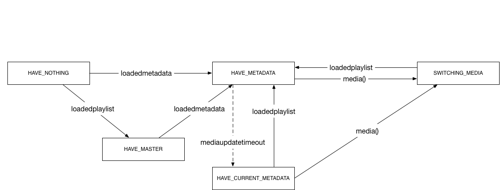

# HLS Overview
The HLS project polyfills support for [HTTP Live Streaming](https://developer.apple.com/library/ios/documentation/NetworkingInternet/Conceptual/StreamingMediaGuide/Introduction/Introduction.html) (HLS) video format. This document is intended as a primer for anyone interested in contributing or just better understanding how bits from a server get turned into video on their display.

## HTTP Live Streaming
HLS has two primary characteristics that distinguish it from other video formats:

- Delivered over HTTP(S): it uses the standard application protocol of the web to deliver all its data
- Segmented: longer videos are broken up into smaller chunks which can be downloaded independently and switched between at runtime

A standard HLS stream consists of a *Master Playlist* which references one or more *Media Playlists*. Each Media Playlist contains references one or more sequential video segments. All these components form a logical hierarchy that informs the player of the different quality levels of the video available and how to address the individual segments of video at each of those levels:

HLS streams can be delivered in two different modes: a "static" mode for videos that can be played back from any point, often referred to as video-on-demand (VOD); or a "live" mode where later portions of the video become available as time goes by. In the static mode, the Master and Media playlists are fixed. The player is guaranteed that the set of video segments referenced by those playlists will not change over time.

Live mode can work in one of two ways. For truly live events, the most common configuration is for each individual Media Playlist to only include the latest video segment and a small number of consecutive previous segments. In this mode, the player may be able to seek backwards a short time in the video but probably not all the way back to the beginning. In the other live configuration, new video segments can be appended to the Media Playlists but older segments are never removed. This configuration allows the player to seek back to the beginning of the stream at any time during the broadcast and transitions seamlessly to the static stream type when the event finishes.

If you're interested in a more in-depth treatment of the HLS format, check out [Apple's documentation](https://developer.apple.com/library/ios/documentation/NetworkingInternet/Conceptual/StreamingMediaGuide/Introduction/Introduction.html) and the IETF [Draft Specification](https://datatracker.ietf.org/doc/draft-pantos-http-live-streaming/).

## HLS Project Overview
This project has three primary duties:

1. Download and parse playlist files
1. Implement the [HTMLVideoElement](https://html.spec.whatwg.org/multipage/embedded-content.html#the-video-element) interface
1. Feed content bits to a SourceBuffer by downloading and transmuxing video segments

### Playlist Management
The [playlist loader](../src/playlist-loader.js) handles all of the details of requesting, parsing, updating, and switching playlists at runtime. It's operation is described by this state diagram:

During VOD playback, the loader will move quickly to the HAVE_METADATA state and then stay there unless a quality switch request sends it to SWITCHING_MEDIA while it fetches an alternate playlist. The loader enters the HAVE_CURRENT_METADATA when a live stream is detected and it's time to refresh the current media playlist to find out about new video segments.

### HLS Tech
Currently, the HLS project integrates with [video.js](http://www.videojs.com/) as a [tech](https://github.com/videojs/video.js/blob/master/docs/guides/tech.md). That means it's responsible for providing an interface that closely mirrors the `<video>` element. You can see that implementation in [videojs-contrib-hls.js](../src/videojs-contrib-hls.js), the primary entry point of the project.

### Transmuxing
Most browsers don't have support for the file type that HLS video segments are stored in. To get HLS playing back on those browsers, contrib-hls strings together a number of technologies:

1. The [Netstream](http://help.adobe.com/en_US/FlashPlatform/reference/actionscript/3/flash/net/NetStream.html) in [video.js SWF](https://github.com/videojs/video-js-swf) has a special mode of operation that allows binary video data packaged as an [FLV](http://en.wikipedia.org/wiki/Flash_Video) to be provided directly
1. [videojs-contrib-media-sources](https://github.com/videojs/videojs-contrib-media-sources) provides an abstraction layer over the SWF that operates like a [Media Source](https://w3c.github.io/media-source/#mediasource)
1. A pure javascript transmuxer that repackages HLS segments as FLVs

Transmuxing is the process of transforming media stored in one container format into another container without modifying the underlying media data. If that last sentence doesn't make any sense to you, check out the [Introduction to Media](media.md) for more details.

### Buffer Management
Buffering in contrib-hls is driven by two functions in videojs-hls.js: fillBuffer() and drainBuffer(). During its operation, contrib-hls periodically calls fillBuffer() which determines when more video data is required and begins a segment download if so. Meanwhile, drainBuffer() is invoked periodically during playback to process incoming segments and append them onto the [SourceBuffer](http://w3c.github.io/media-source/#sourcebuffer). In conjunction with a goal buffer length, this producer-consumer relationship drives the buffering behavior of contrib-hls.
